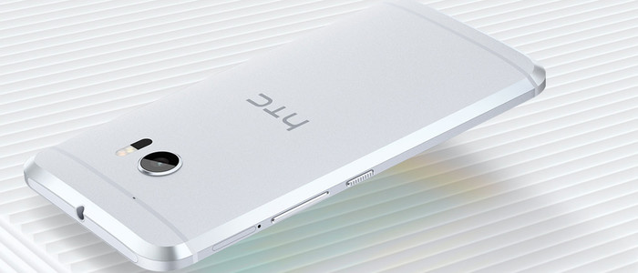

# mySwiper

**移动端观看**


**模仿[Swiper](http://www.swiper.com.cn/)制作的一个轮播及滑动插件，可在PC及移动端使用，目前实现功能：**

* 图片轮播；
* 鼠标悬停或拖动翻页时轮播暂停；
* PC端鼠标拖动翻页，手机端滑动翻页；
* 点击上下页按钮翻页；
* 点击分页按钮翻到指定页；
* 翻页到底有回弹动画；
* 拖动距离不够1/4则回弹；
* 一些自定义设置；
* 其它；

**待添加：**
* 移动到最后一页无缝返回第一页；
* 另外一种轮播效果，如方格淡入，透明度淡入；
* 另外一种轮播方式；

**优点：**
* 轻量；
* 无依赖，纯原生；

**缺点：**
* 可能有bug，欢迎随时指正；
* 因为时间比较赶，代码也比较挫；
* 不兼容低版本IE，如addEventListener，getElementsByClassName等等；

**使用方法：**
* 引入js文件后 `new Swiper` 调用：
```
new Swiper({
	// 绑定的DOM对象，必选
	element: document.getElementsByClassName('swiper-container')[0],
	// 设置翻页动画过度时间，可选
	time: .4,
	// 设置翻页动画，可选
	transitionTiming: "linear",
	// 设置轮播间隔，可选
	intervalTime: 3000,
	// 设置分页，可选
	pagination: true,
	// 设置上下页按钮，可选
	button: true
});
```
**注意：**
* 按照下面模板设置，即DOM结构及类名：
```
<div class="swiper-container">
	<div class="swiper-wrapper">
		<div class="swiper-slide"></div>
		<div class="swiper-slide"></div>
		<div class="swiper-slide"></div>
		<div class="swiper-slide"></div>
		<div class="swiper-slide"></div>
		<div class="swiper-slide"></div>
	</div>
	<!-- 分页器（不需要手动添加） -->
	<div class="swiper-pagination">
		<div class="bullet"></div>
		<div class="bullet"></div>
	</div>			
	<!-- 如果需要导航按钮 -->
	<div class="swiper-button-prev"></div>
	<div class="swiper-button-next"></div>			
</div>
```
* 在移动端取消了上下页按钮，因为没什么用；
* 移动端与PC端分页有所不同，具体看Js；
* 其它请看Js；
